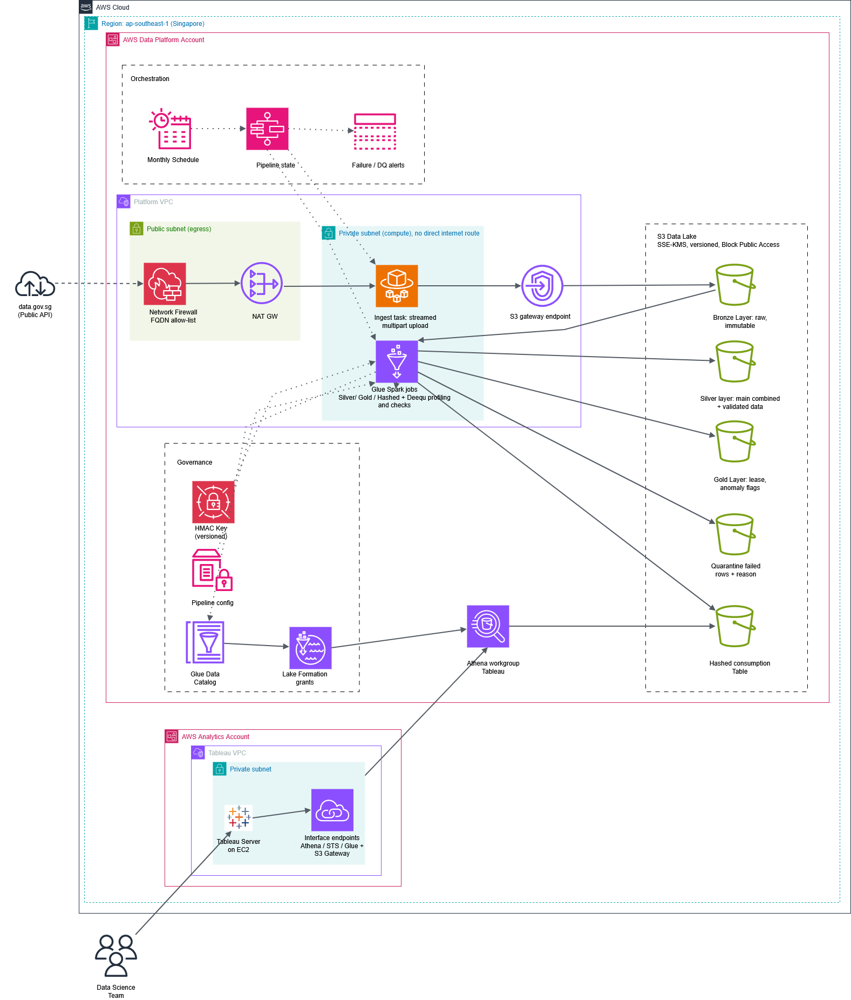
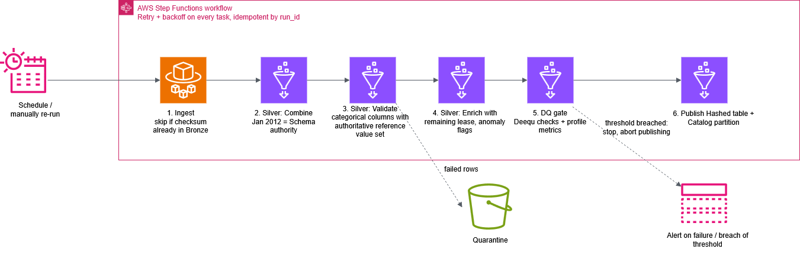
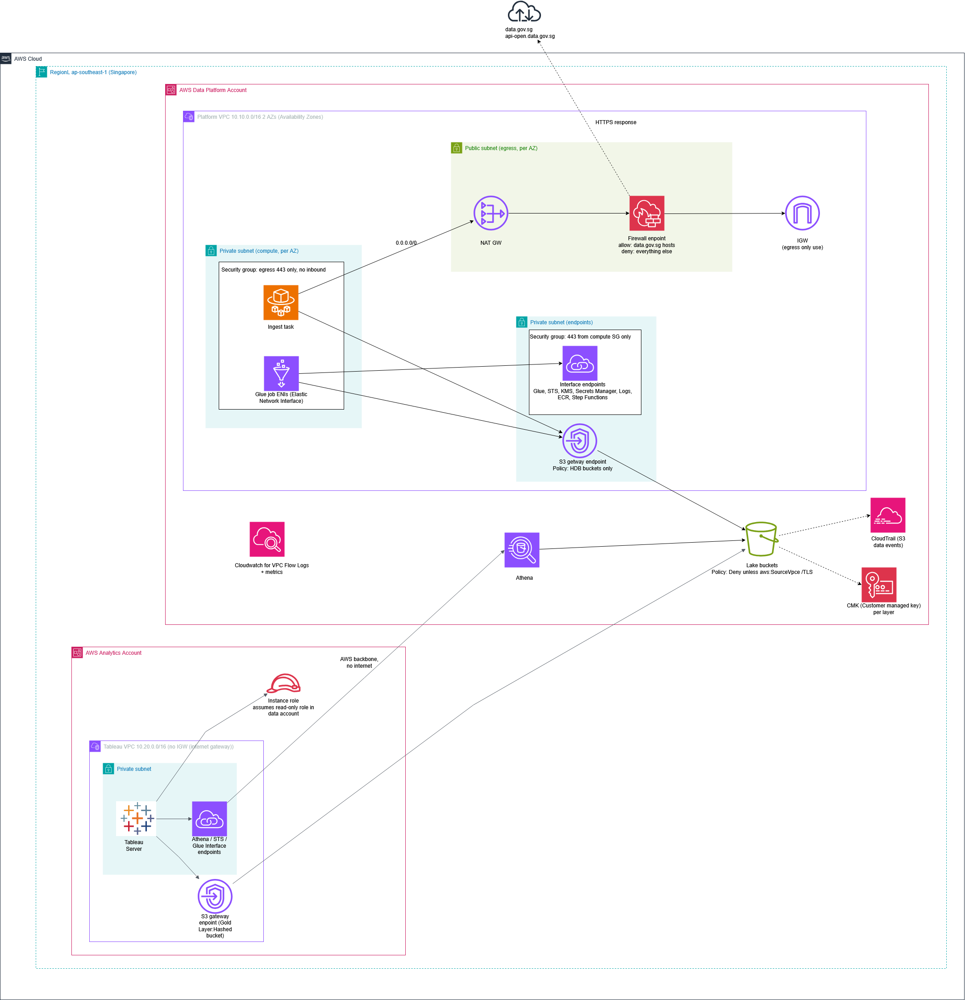

# Part 2: Solution Architecture

This design takes the Part 1 pipeline to AWS, with S3 as the target data store. It covers batch ingestion from 
data.gov.sg and Tableau access to the data lake for the data science team.

The goal is a design that meets the requirements proposed. Every component is managed and serverless where possible, so
the team runs very little infrastructure. Since the assignment explicitly mentioned a focus on security, reliability,
scalability, maintainability and performance, I did not focus on cost optimization and only mentioned it a little. 
In a real-life scenario, that would be a significant factor in certain decisions, especially when thinking about the
sustainability of the system long-term.

Diagrams use the official [AWS Architecture Icons](https://aws.amazon.com/architecture/icons/) in draw.io so they can be
traced back. However, I did use 2-3 draw.io objects for users and rectangles.

## 1. Assumptions

| # | **Assumption** | **Why it matters** |
|---|---|---|
| A1 | Region is `ap-southeast-1` (Singapore) for all components. | Data residency, and lowest latency to data.gov.sg and presumable users. |
| A2 | data.gov.sg is reached over HTTPS through its public API (`initiate-download` then `poll-download`, which returns a time-limited download URL). | Decides which hostnames the egress firewall allows. |
| A3 | The source is updated at most monthly. A monthly schedule plus on-demand re-runs is enough. | No streaming or event-driven ingestion needed in requirements. |
| A4 | Data volume is small for part 1 (about a million rows) but individual files can exceed 100 MB. | Ingestion process must stream and transforms must scale out without a redesign. |
| A5 | The data platform and Tableau live in separate AWS accounts under one AWS Organization. If they share an account, the design still holds and the cross-account role becomes a same-account role. | Drives the IAM (Identity and access management) and Lake Formation sharing model. |
| A6 | Tableau Server runs on EC2 in its own private VPC with no internet gateway. | Tableau reaches AWS services only through VPC endpoints. |
| A7 | The Data Science Team should see the Hashed output only, not Bronze or Silver. | Least privilege, and preserves raw data inside the platform. |

## 2. End-to-end view

Decisions are explained in later sections.

| **Step** | **What happens** | **Service** |
|---|---|---|
| 1 | A monthly schedule (or a manual re-run) starts the pipeline. | EventBridge Scheduler, Step Functions |
| 2 | An ingest task in a private subnet calls data.gov.sg through the egress path and streams each file into Bronze. | ECS Fargate, NAT Gateway, Network Firewall |
| 3 | Spark jobs combine, validate, enrich and publish through the medallion layers. Failed rows go to Quarantine. | AWS Glue (Spark), Deequ |
| 4 | Tables are registered in the catalog and access is granted per table and column. | Glue Data Catalog, Lake Formation |
| 5 | Tableau queries the Hashed table through Athena, entirely over private endpoints. | Athena, VPC interface endpoints |

## 3. Data ingestion

### 3.1 Large files and complex processing 

**Ingestion compute - ECS Fargate task:** Part 1's downloader is Python that streams in chunks, retries with backoff and 
skips finished files. It is packaged as a container image in ECR and run as a Fargate task started by Step Functions.

- **Streaming instead of buffering:** The response body is piped into an S3 multipart upload (for example 64 MB parts). 
This way memory use stays flat whatever the file size, which is the production version of Part 1's "streamed to disk in chunks".
A 100 MB file and a 10 GB file use the same task size.
- **Integrity:** Each part is uploaded with a SHA-256 checksum, and the completed object's size and checksum are recorded
in the object metadata and a run manifest. A file that fails the check is never marked complete so it can be re-run
manually.
- **Atomic landing:** In part 1, a temp file was written and renamed. On S3 the equivalent is that a multipart upload is 
invisible until `CompleteMultipartUpload`, so downstream jobs never see a half-written file. An S3 lifecycle rule aborts
incomplete multipart uploads after 1 day for extra robustness.
- **Idempotency:** Bronze keys are `bronze/resale/source=<dataset_id>/ingest_date=<yyyy-mm-dd>/<file>`. If a file with 
the same checksum is already there, the task skips it. Re-running a failed pipeline is always safe.

#### Ingestion task decisions:
*Fargate vs. Lambda:* Lambda has a 15-minute limit and an ephemeral storage cap. That is fine for today's files but 
becomes a hard ceiling as files grow. Fargate has no runtime limit, runs the same container locally, and is reasonably
cheap per run. 

*Fargate vs. Glue Python shell:* would also work, but Fargate keeps the downloader as a plain container that is easy to 
test and reuse compared ot a glue python shell

#### Compute decisions:
**Transform compute - AWS Glue (Spark):** The Part 1 logic is written as column expressions and filters mostly, so it maps 
directly to PySpark and runs unchanged on Glue (it can be tested in Spark local mode in CI). 
Glue auto-scaling handles growth without capacity planning. The data-quality checks move to Deequ (pydeequ), which runs 
inside the same Spark job.

**Orchestration - Step Functions:** See the flow below. Every task has retries with exponential backoff, and every step 
is keyed by `run_id`, so a failed run is fixed by simply running it again.

| **Stage** | **Part 1 rules carried over** | **Output** |
|---|---|---|
| 1. Ingest | Skip finished files, retries, streamed writes | Bronze (immutable) |
| 2. Combine | Jan 2012 dataset is the strict authoritative schema | Silver main combined |
| 3. Validate | Town, Flat Type, Flat Model, storey_range checked against the Jan 2012 reference values | Silver (valid) and Quarantine (failed rows with a reason column) |
| 4. Enrich | Remaining lease as of 1 Jan 2027 (99-year lease, rounded down to years and months); anomaly flags | Gold |
| 5. DQ gate | Profiling metrics and thresholds (row counts, null rates, quarantine %, anomaly %) | Metrics to CloudWatch; pipeline stops on breach |
| 6. Publish | Keyed hash of identifying columns (HMAC, key in Secrets Manager) | Hashed table, catalog partition added |

The DQ gate sits **before** publish. If a threshold is breached, the state machine stops, alerts through SNS, and 
Tableau keeps seeing the last good version. By doing so, bad data never reaches consumers and can be troubleshot.

#### **Storage layout**

| **Layer** | **Format** | **Access** |
|---|---|---|
| Bronze | Original files as received | Write once. S3 Versioning on, deletes denied by bucket policy. Only the ingest role writes. |
| Silver / Quarantine | Parquet (zstd or snappy), partitioned by `year`, `month` | Glue job role only |
| Gold | Parquet, partitioned by `year`, `month` | Glue job role only |
| Hashed | Parquet, partitioned by `year`, `month` | Read-only to the Tableau role through Lake Formation |

Outputs are written by overwriting whole partitions, so re-runs replace rather than duplicate data. Rightfully, Apache Iceberg 
would add ACID commits and time travel (both very valuable features) which makes it a reasonable next step if the data 
starts receiving late corrections, but plain partitioned Parquet is enough for a monthly batch as long as the data isn't
changed regularly afterward. If it is, then switching to Apache Iceberg would make sense, and would fit into the
designed architecture.

**Configuration and secrets:** In part 1, YAML file becomes a versioned object in SSM Parameter Store (dataset IDs, 
date range, DQ thresholds), read at job start. The HMAC key moves from an environment variable to Secrets Manager. 
Jobs read it through their IAM role, and the key version used is written into the run manifest so hashes stay 
reproducible across key rotations which is a requirement that was inferred but not explicitly mentioned.

### 3.2 Network and component segmentation

The platform VPC spans two Availability Zones and has three subnet tiers, each with one job:

| **Tier** | **Contents** | **Route to internet** | **Security group** |
|---|---|---|---|
| Egress | NAT Gateway, Network Firewall endpoint | Yes, through the IGW | n/a |
| Private compute | Fargate ingest task, Glue job ENIs | Only through NAT, then the firewall | Outbound 443 only, no inbound |
| Endpoints | Interface endpoints (Glue, STS, KMS, Secrets Manager, CloudWatch Logs, ECR, Step Functions) | None | Inbound 443 from the compute SG only |

**The only outbound path to the internet is through the firewall.** AWS Network Firewall runs a stateful domain 
allow-list (TLS SNI inspection) that permits the data.gov.sg API and download hostnames and drops everything else. 
A compromised job or a bad dependency cannot send data anywhere else. In addition, nothing on the internet can initiate
a connection into the VPC as there are no public IPs and no inbound security group rules.

**AWS service traffic never touches the internet.** S3 goes through a gateway endpoint and other services through
interface endpoints. The S3 endpoint policy only allows HDB's lake buckets, and the bucket policies deny any request
that does not arrive through that endpoint (`aws:SourceVpce`) or is not over TLS.

> **Build-time check:** if the data.gov.sg download URL points at an S3 bucket in the same region, that request is routed through the S3 gateway endpoint rather than the NAT, and the restrictive endpoint policy above will block it. The fix is to allow `s3:GetObject` on that specific source bucket in the endpoint policy. This should be confirmed against the live API during build.

**Separation of duties:** The ingest task role can write to Bronze only. Glue job roles can read Bronze and write Silver,
Gold and Hashed. Neither can read the other's secrets. This mirrors Part 1's one-folder-per-layer design, enforced by 
IAM instead of convention.

## 4. Data exploitation

### 4.1 Tableau querying the data lake

**Query engine - Amazon Athena:** Tableau has a native Athena connector (JDBC). Athena is serverless, reads the Parquet 
tables directly through the Glue Data Catalog, and charges per data scanned, which suits a small dataset with occasional
analyst queries.
- A dedicated Athena **workgroup** for Tableau enforces the query-result location, encryption of results, and a 
per-query data-scanned limit to stop runaway queries.
- **Lake Formation** grants the Tableau role `SELECT` on the Hashed database only. Column-level grants can hide any 
field that should stay internal. Bronze, Silver, Gold (identifier added) and Quarantine are not visible to Tableau at all.
- **Performance:** Partitioning by `year` and `month`, Parquet column pruning and small file counts keep scans low. 
For dashboards that are opened often, a scheduled Tableau extract refreshed after each pipeline run gives fast load 
times and almost no Athena cost. Live connections stay available for ad-hoc analysis.

*Alternative considered:* 
- Redshift (Serverless, with Spectrum) gives better high-concurrency performance and caching. 
It adds a warehouse to run and pay for, which is not justified at this volume. It is the upgrade path if many concurrent
dashboard users appear.
- However, if the data is meant to be accessed far more often but not at scale per se, it would be more reasonable to 
consider alternatives such as Tableau extracts. Tableau would pull the hashed table into memory after each pipeline run. 
Step Functions could trigger this through Tableau's REST API. The data science team can then query the extract and 
Athena is only used for Ad-hoc exploration.

### 4.2 Private traffic

The Tableau VPC has no internet gateway and no NAT. All its AWS traffic stays on the AWS network:

| **Need** | **How it is reached privately** |
|---|---|
| Submit queries | Athena interface endpoint in the Tableau VPC |
| Authenticate | STS interface endpoint (assume the cross-account role) |
| Read catalog metadata | Glue interface endpoint |
| Fetch large result sets | S3 gateway endpoint, restricted to the Athena results bucket |

**Why opt for endpoints in the Tableau VPC rather than VPC peering or Transit Gateway?** 

Athena is a regional service, not something inside the platform VPC, so the two VPCs do not need to route to each other 
at all. Putting endpoints in the Tableau VPC keeps the networks fully separate, avoids CIDR overlap problems, and means
a problem in one VPC cannot spread to the other. If HDB already runs a hub-and-spoke network, centralized shared 
endpoints behind Transit Gateway are an equally valid choice.

**Identity** 

Tableau Server's EC2 instance role assumes a read-only role in the data platform account. There are no long-lived
access keys. The trust policy only allows that one instance role, and the endpoint policies only allow access to
HDB's workgroup and buckets. Every query is logged in CloudTrail and Athena query history.

## 5. How the design meets the five qualities required

| **Quality** | **Key decisions** |
|---|---|
| **Security** | Private subnets with no inbound path; one egress path through a domain allow-list firewall; VPC endpoints for all AWS traffic; customer-managed key per layer; S3 with Block Public Access, TLS-only and VPC-endpoint-only bucket policies; least-privilege roles per stage; Lake Formation table and column grants; secrets in Secrets Manager with rotation; CloudTrail data events, VPC Flow Logs and GuardDuty. |
| **Reliability** | Multi-AZ subnets with a NAT Gateway per AZ; retries with backoff on every step; checksum-verified, atomic writes; idempotent re-runs keyed by `run_id`; immutable versioned Bronze so any layer can be rebuilt; DQ gate stops bad data before publish; SNS alerts on failure. |
| **Scalability** | Streaming ingestion with flat memory; Glue auto-scaling Spark; serverless Athena; partitioned Parquet; if the data grows, a config change would suffice. |
| **Maintainability** | Same transformation code runs locally (Spark local mode) and on Glue; config outside the code in Parameter Store; all infrastructure in IaC through CI/CD; few managed services|
| **Performance** | Parquet with zstd or Snappy compression and column pruning; year/month partitions; overwrite by partition to keep file counts low; Tableau extracts for frequent dashboards, live Athena for ad-hoc queries. |

## 6. Operations

- **Monitoring:** Step Functions execution status, Glue job metrics, and the Part 1 per-stage metrics (rows in, rows out, rows quarantined, anomalies flagged) are published to CloudWatch with alarms on failures and on DQ thresholds.
- **Lineage:** Each run writes a manifest (source files, checksums, row counts per stage, config version, HMAC key version) next to its outputs, so any number in Tableau can be traced back to a source file.
- **Cost:** Expected to be low: per-second Fargate, per-DPU-second Glue, per-TB-scanned Athena. The fixed costs are the NAT Gateways, Network Firewall endpoints and interface endpoints which are ,of course, the price of the network isolation.

## 7. Decisions and trade-offs summary

| **Decision** | **Chosen** | **Not chosen** | **Reason** |
|---|---|---|---|
| Ingestion compute | Fargate | Lambda, Glue Python shell | No runtime limit; could reuse the Part 1 downloader as a container |
| Transform compute | Glue Spark | EMR, Polars on Fargate | Serverless Spark; Part 1 logic ports directly; scales without capacity planning |
| Orchestration | Step Functions | Airflow | One linear pipeline does not justify running Airflow |
| Table format | Partitioned Parquet | Iceberg | Monthly batch with partition overwrite is enough; Iceberg is the next step if corrections turn out to be frequent |
| Query engine | Athena | Redshift Serverless | Small data, low concurrency, pay per query |
| Egress control | Network Firewall allow-list | NAT only | NAT alone lets jobs reach any host; the allow-list limits egress to data.gov.sg |
| Tableau connectivity | Endpoints in the Tableau VPC | Peering, Transit Gateway | Athena does not need VPC-to-VPC routing; keeps networks isolated |
