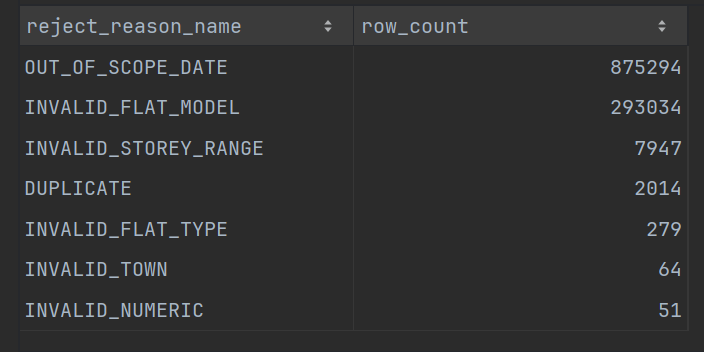
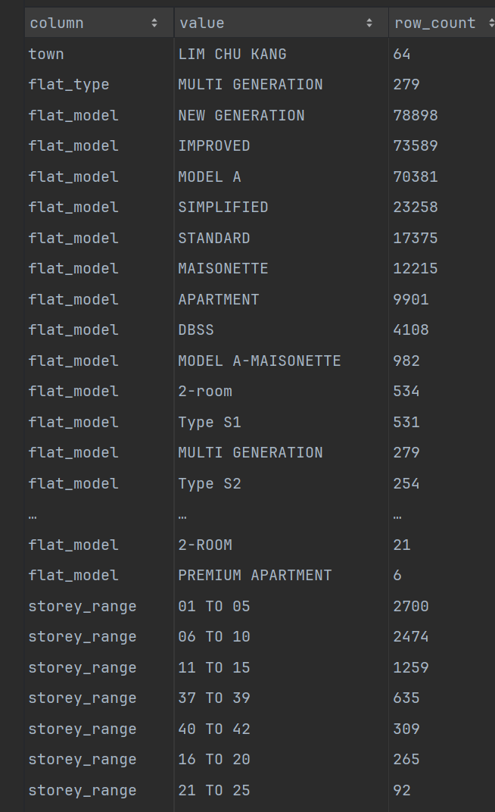
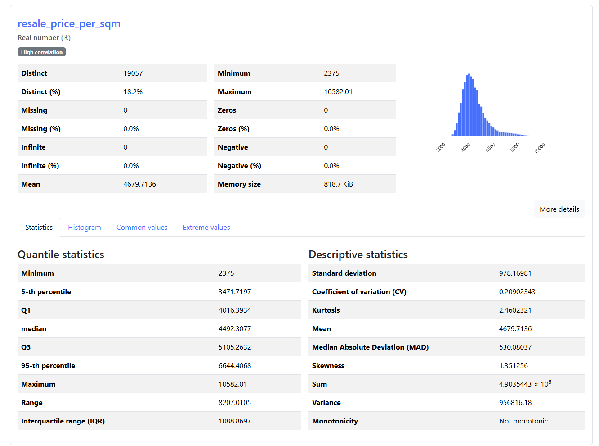
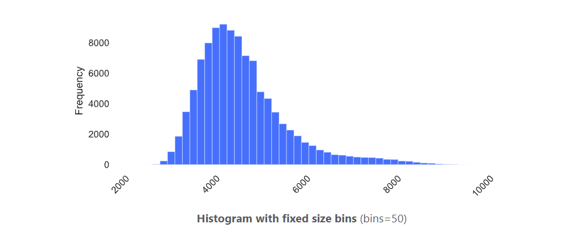
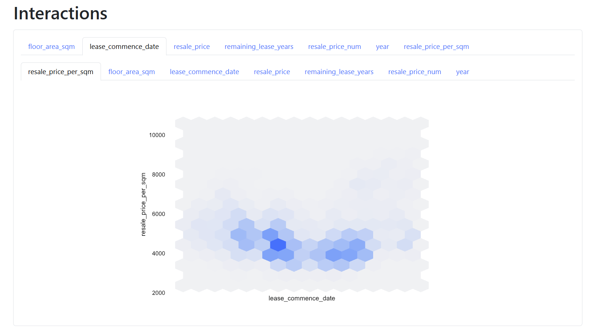
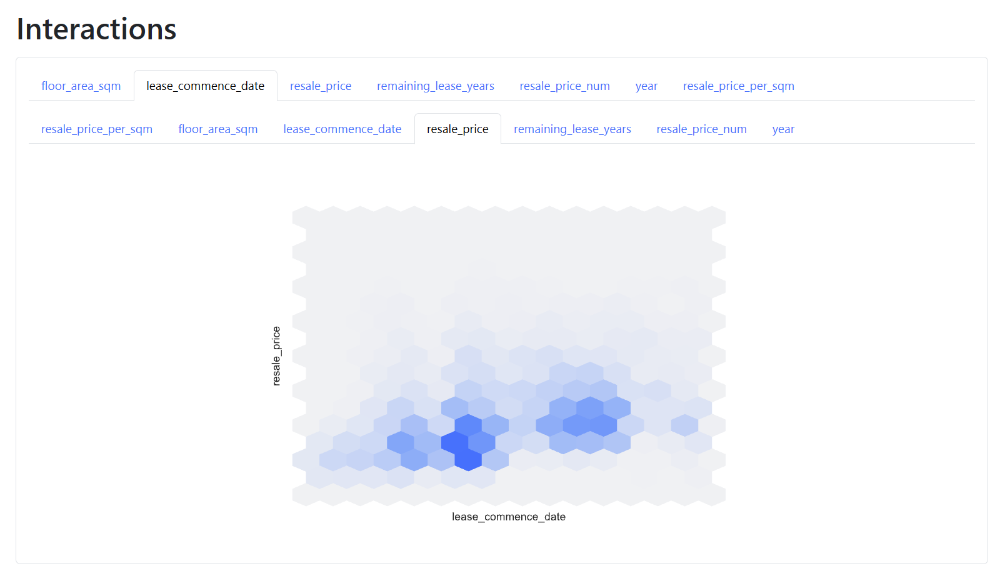
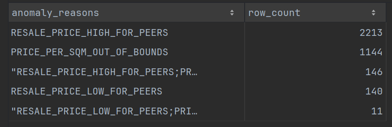
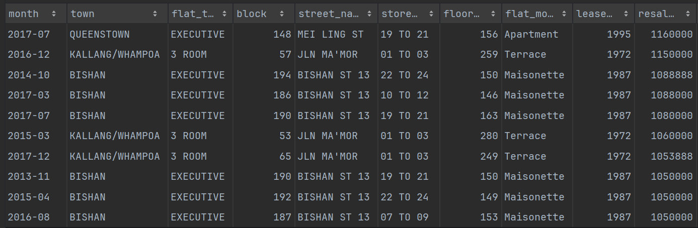
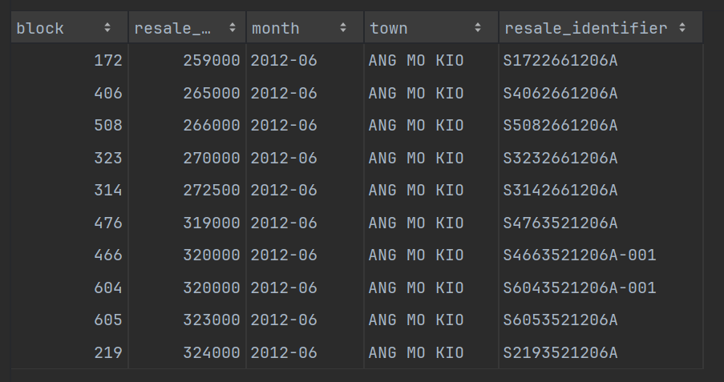
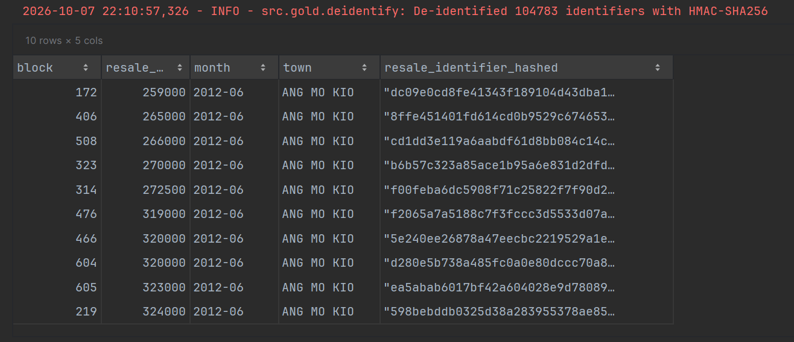

# Data Profiling Report: HDB Resale Flat Prices (Jan 2012 to Dec 2017)

**What this report covers.** How the data looks and behaves at every stage of the pipeline (Bronze, Silver, Gold), 
and what ended up in the Quarantined bucket and why.

**Where the evidence comes from.** The notebook [`notebooks/hdb_resale_etl.ipynb`](../notebooks/hdb_resale_etl.ipynb) 
produces everything quoted here:

- ydata-profiling reports for the authoritative set and the derived columns: `reports/profiling/`
- Polars-native metrics taken after every stage: `reports/profiling/stage_profile.csv`
- Row-count reconciliation, quarantine summaries and anomaly summaries: notebook sections 3.3 to 5

## 1. Key findings

| # | Finding | Why it matters |
|---|---|---|
| 1 | The full collection is small: just under 1 million rows and about 100 MB. | An in-memory engine (Polars) is enough, so Spark was not justified at this stage. |
| 2 | No nulls in any column after combining the files. | Null checks stay in validation anyway, as future-proofing. |
| 3 | The strict authoritative set (Jan 2012) is much narrower than the data as a whole: town 27 to 26, flat_type 8 to 7, flat_model 34 to 17, storey_range 25 to 12 distinct values. | This vocabulary gap drives most of the non-date rejections. |
| 4 | Quarantine is dominated by scope: 875294 rows fall outside Jan 2012 to Dec 2017. | Most of the quarantine bucket is expected and is not a data-quality problem. |
| 5 | The second-largest reason is `INVALID_FLAT_MODEL` (293034 rows), and about half of it is a casing difference (`NEW GENERATION`, `IMPROVED`). | The case-sensitive reading of "strict" has a cost albeit seeing as entries are outside of scope they would end up in quarantine either way likely. |
| 6 | 2014 duplicate rows exist, which I did not expect. | Duplicates are quarantined (first occurrence kept). |
| 7 | Price anomalies: 1866 too high and 151 too low against peers. Observed price per sqm ranged from 2375 to 10582. | My first price-per-sqm bounds were too low and were recalibrated after profiling. |
| 8 | Remaining lease shows only a weak relationship with price per sqm. | This contradicted my expectation (see section 3.4). |
| 9 | Row counts reconcile at every stage, and the validated data keeps matching the authoritative profile with no drift. | Nothing is lost between layers. |

## 2. Source data

| Property | Observation |
|---|---|
| Source | data.gov.sg collection 189 (HDB resale flat prices), queried through the API |
| Time span | 1990 to 2017 onwards |
| Size | just under 1 million rows, about 100 MB of CSV |
| Scope for this pipeline | 2012-01 to 2017-12, inclusive |
| Identity of each file | the dataset id, which is unique and stable on data.gov.sg |

Below are the metrics I calculated for the source data:

| **dataset_id**                                     | **row_count** | **col_count** | **csv_size_mb** | **in_scope_rows** |
|----------------------------------------------------|---------------|---------------|-----------------|-------------------|
| d_2d5ff9ea31397b66239f245f57751537                 | 52203         | 10            | 4.16            | 52203             |
| d_43f493c6c50d54243cc1eab0df142d6a                 | 369651        | 10            | 29.37           | 3188              |
| d_8b84c4ee58e3cfc0ece0d773c8ca6abc                 | 242144        | 11            | 23.95           | 20509             |
| d_ea9ed51da2787afaf8e51f827c304208                 | 37153         | 11            | 3.07            | 37153             |
| d_ebc5ab87086db484f88045b47411ebc5                 | 287196        | 10            | 22.64           | 0                 |

The five files contribute very unevenly to the 2012 to 2017 scope:

- **Two files are fully in scope** (52203 and 37153 rows), **one is fully out** (287196 rows), and **two straddle the boundaries**. Only 3188 of 369651 rows in `d_43f4...` and 20509 of 242144 rows in `d_8b84...` fall inside the window.
- **Only 11.4% of the collection is in scope** (113053 of 988347 rows). The pipeline still ingests everything, so every row is accounted for, but nearly 9 in 10 rows exist only to be filtered out.
- **The schema is not stable across files.** Two files have 11 columns against the authoritative 10. The extra column is not part of the Jan 2012 schema and is dropped at combine.

## 3. Lifecycle profile

### 3.1 Bronze and combine

Files are read as strings with no type inference, so values stay exactly as received. The Jan 2012 dataset defines the 
main schema.

- A quick Polars-native profile after combining showed **no nulls** in any column.
- Distinct-value counts per column were sensible. They change sharply once the authoritative set is applied (section 3.2).
- Combining added nothing and dropped nothing: the combined row count equals the sum of the raw files.

The table below is the table above but now with data from the authoritative set and combined where relevant:

| **dataset_id**                                     | **row_count** | **col_count** | **csv_size_mb** | **in_scope_rows** |
|----------------------------------------------------|---------------|---------------|-----------------|-------------------|
| d_2d5ff9ea31397b66239f245f57751537                 | 52203         | 10            | 4.16            | 52203             |
| d_43f493c6c50d54243cc1eab0df142d6a                 | 369651        | 10            | 29.37           | 3188              |
| d_8b84c4ee58e3cfc0ece0d773c8ca6abc                 | 242144        | 11            | 23.95           | 20509             |
| d_ea9ed51da2787afaf8e51f827c304208                 | 37153         | 11            | 3.07            | 37153             |
| d_ebc5ab87086db484f88045b47411ebc5                 | 287196        | 10            | 22.64           | 0                 |
| COMBINED (total - cols are from authoritative set) | 988347        | 10 (authoritative set) | 83.19  | 113053            |

Table found in `notebooks/hdb_resale_etl.ipynb` section 3.1

**Reconciliation:** The combined set has 988347 rows and 83.19 MB, which is exactly the sum of the five files. 
Combining added nothing and dropped nothing.

The table below is the data profiling of the bronze combined dataset with various metrics run for each column, including
row_count, null_count, null_percentage and distinct value count:

**What the column profile shows:**

- **No nulls (with a small caveat):** Because every value is a string at this stage, blanks or placeholder text would not count as null. Zero nulls means no missing values in the strict sense. Empty strings are checked separately in validation.
- **Monthly coverage is continuous:** `month` has 442 distinct values, which is exactly the number of months from Jan 1990 to Oct 2026. No month is missing from the collection.
- **Prices are heavily rounded:** `resale_price` has only 10352 distinct values across 988347 rows, about 95 rows per value on average. Many unrelated sales share an exact price. Together with banded storeys and standard floor areas, this means two genuine sales in the same block and month could produce identical rows.
- **The leases span almost six decades:** `lease_commence_date` has 58 distinct years.
- **Categorical counts mix eras:** The distinct counts for town, flat type, flat model and storey range cover 1990 to 2026, so they combine vocabulary from different periods and file formats.

| **stage**       | **column**          | **row_count** | **null_count** | **null_percentage** | **distinct_count** |
|-----------------|---------------------|---------------|----------------|---------------------|--------------------|
| silver_combined | month               | 988347        | 0              | 0.0                 | 442                |
| silver_combined | town                | 988347        | 0              | 0.0                 | 27                 |
| silver_combined | flat_type           | 988347        | 0              | 0.0                 | 8                  |
| silver_combined | block               | 988347        | 0              | 0.0                 | 2788               |
| silver_combined | street_name         | 988347        | 0              | 0.0                 | 597                |
| silver_combined | storey_range        | 988347        | 0              | 0.0                 | 25                 |
| silver_combined | floor_area_sqm      | 988347        | 0              | 0.0                 | 392                |
| silver_combined | flat_model          | 988347        | 0              | 0.0                 | 34                 |
| silver_combined | lease_commence_date | 988347        | 0              | 0.0                 | 58                 |
| silver_combined | resale_price        | 988347        | 0              | 0.0                 | 10352              |
| silver_combined | source_file         | 988347        | 0              | 0.0                 | 5                  |

Table found in `notebooks/hdb_resale_etl.ipynb` section 3.2

### 3.2 The authoritative set (Jan 2012)

Jan 2012 defines "valid". It is small, so it is profiled with ydata-profiling (the slice is converted to pandas, so 
performance is not a concern). The distinct values of the four validated columns form the allowed sets.

| Column | Distinct values in combined data | Distinct values in authoritative set |
|---|---|---|
| town | 27 | 26 |
| flat_type | 8 | 7 |
| flat_model | 34 | 13 |
| storey_range | 25 | 12 |

The drop in distinct values does not mean the market is more varied outside Jan 2012. It comes from three separate 
causes, and each one has a different consequence for what gets rejected:

1. **Spelling drift:** The same category is written differently across files. Flat model shows this most clearly:
`NEW GENERATION` and `New Generation` count as two values. Majority of the `INVALID_FLAT_MODEL` rejections are casing
alone, so these are valid flats rejected over formatting.
2. **Encoding changes:** Storey ranges are banded differently in some periods, so part of the 25 values describe the
same floors cut into different bands. These rows cannot be mapped onto Jan 2012 bands without guessing.
3. **Sampling gaps:** One month of 1559 sales will not contain every valid category. A town or flat type with low volume
can be missing simply because nothing sold that month. These rows are real and in scope, but strict validation rejects them.

Only the second cause reflects data the pipeline genuinely cannot use. The first and third reject valid sales, which 
is the real cost of a strict, single-month definition of "valid". Both are configurable: case-insensitive matching fixes
the first, and widening the authoritative window fixes the third.

The reference month itself is clean (no duplicates, no missing cells), while the full collection has 2014 duplicate rows.

**Overview:** The reference month has 1559 rows across 10 columns: 5 categorical, 2 text (`block`, `street_name`) and 
3 numeric (`floor_area_sqm`, `lease_commence_date`, `resale_price`). This matches the intended schema, so later type 
casting can rely on it.

The data overview and accompanying data types are exactly as expected.

**Alerts:** ydata-profiling raises six alerts. None of them is a data-quality problem, but each one affects how later 
stages should treat the data.

- **`month` is constant ("2012-01"):** This is expected for a one-month slice. It also means the reference says nothing 
about how values change over time, and that is where most non-date rejections in section 3.3 come from.
- **The other five alerts are correlations:** between flat type, flat model, floor area, lease commence date and resale 
price. Taken together, they describe one underlying signal: flat size. Type and model largely determine floor area, 
floor area drives price, and when a flat was built is tied to how big it is.

**Interaction between resale price and floor area sqm:** Price against floor area shows a clear positive, roughly linear
relationship. Most sales cluster at the smaller, cheaper end. The spread widens as floor area grows: large flats of the
same size sell across a much wider price range than small ones. Size explains most of the price for smaller flats and
less for larger ones, where town, storey and lease age carry more weight.

Correlations such as the ones in the alerts and the visualization above inform the following:

1. **Price is affected by various factors:** A price that is normal for an Executive flat would be extreme for a 3-room.
This is why anomaly detection later requires a method that can compare against peers, not just raw price compared against
the whole dataset.
2. **Cross-field checks become possible:** A floor area far outside the usual range for its flat type is a likely error,
even when each value passes on its own.

### 3.3 Validation

All rules run together, so one row can fail several. Reasons are joined with `;`. The quarantine bucket is analyzed in section 3.3.

After validation, the profile of the validated rows continued to match the authoritative profile, with no drift observed.
The validation logs also confirm the size of each allowed set: 26 towns, 7 flat types, 13 flat models and 12 storey ranges.

Authoritative categorical columns value set:

| Property     | Value                                                                                                                                                                                                                                                                                                                                                                                                                                                                                                   |
| ------------ | ------------------------------------------------------------------------------------------------------------------------------------------------------------------------------------------------------------------------------------------------------------------------------------------------------------------------------------------------------------------------------------------------------------------------------------------------------------------------------------------------------- |
| town         | [   "ANG MO KIO",   "BEDOK",   "BISHAN",   "BUKIT BATOK",   "BUKIT MERAH",   "BUKIT PANJANG",   "BUKIT TIMAH",   "CENTRAL AREA",   "CHOA CHU KANG",   "CLEMENTI",   "GEYLANG",   "HOUGANG",   "JURONG EAST",   "JURONG WEST",   "KALLANG/WHAMPOA",   "MARINE PARADE",   "PASIR RIS",   "PUNGGOL",   "QUEENSTOWN",   "SEMBAWANG",   "SENGKANG",   "SERANGOON",   "TAMPINES",   "TOA PAYOH",   "WOODLANDS",   "YISHUN" ] |
| flat_type    | [   "1 ROOM",   "2 ROOM",   "3 ROOM",   "4 ROOM",   "5 ROOM",   "EXECUTIVE",   "MULTI-GENERATION" ]                                                                                                                                                                                                                                                                                                                                                                             |
| flat_model   | [   "Adjoined flat",   "Apartment",   "Improved",   "Maisonette",   "Model A",   "Model A-Maisonette",   "Model A2",   "Multi Generation",   "New Generation",   "Premium Apartment",   "Simplified",   "Standard",   "Terrace" ]                                                                                                                                                                                                                             |
| storey_range | [   "01 TO 03",   "04 TO 06",   "07 TO 09",   "10 TO 12",   "13 TO 15",   "16 TO 18",   "19 TO 21",   "22 TO 24",   "25 TO 27",   "28 TO 30",   "31 TO 33",   "34 TO 36" ]                                                                                                                                                                                                                                                                                       |

Three details in these sets that will be relevant to the data validation rejections that follow:

- `flat_model` is in title case (`New Generation`), so any file that writes models in uppercase fails.
- `flat_type` spells `MULTI-GENERATION` with a hyphen, while other files may use `MULTI GENERATION`.
- `storey_range` uses 3-floor bands that stop at `34 TO 36`. Five-floor bands and anything above floor 36 fail.

According to logs of the categorical columns and the count of their value sets, the counts look like the following:

It is clear that the validation will lead to a decent chunk of the data being quarantined as the requirements call for
a "strict" authoritative set.

The results of the validation can be observed below with the reject reasons and the accompanied row_count.

Note: A row can have multiple rejection reasons.

These counts cover the whole collection, including rows already out of scope. `INVALID_FLAT_MODEL` alone (293034) is 
more than 2.5 times the 113053 in-scope rows, so most of these rows would have been quarantined for their date anyway.
The real cost of strict validation is the in-scope rows that fail only on non-date rules.

As mentioned elsewhere, the `OUT_OF_SCOPE_DATE` is the largest contributor to the quarantined data as most of the dataset
is data outside the scope.

I have also attached an excerpt from the results of the function summarize_rejections which gives the column
a `INVALID_<COLUMN>` rejection was from and the accompanying values and rows that were affected.

Grouping the rejected values by cause shows that most of them are not bad data:

1. **Formatting differences (valid flats, different spelling):** At least 286884 of the 293034 `INVALID_FLAT_MODEL` 
rows (98%) are uppercase versions of values in the reference set, such as `NEW GENERATION`, `IMPROVED` and 
`MODEL A`. `MULTI GENERATION` fails `flat_type` because of the missing hyphen and `flat_model` because of casing. 
Normalizing case and punctuation before validation would remove the formatting rejections, but most of these rows fall 
outside 2012 to 2017 and would stay quarantined for their date.
2. **Encoding changes (unusable as is):** `01 TO 05` through `21 TO 25` are 5-floor bands (6790 rows). They cannot be 
mapped onto 3-floor bands without guessing which floor the flat is on, so rejecting them is the right call.
3. **Valid values the reference month never saw:** `DBSS` (4108), `2-room` (534), `Type S1` (531) and `Type S2` (254) 
are real flat models that had no sales in Jan 2012. `37 TO 39` (635) and `40 TO 42` (309) are valid bands for blocks
taller than anything sold that month. `LIM CHU KANG` (64) is a real town with no sales that month. These are genuine
sales rejected only because one month is a narrow reference.

Strict validation is doing two jobs at once: catching format inconsistencies and catching values that are valid but
unseen. Only group 2 is data the pipeline cannot use. Groups 1 and 3 could be recovered by normalizing formats before
validation and by building the reference from the full in-scope window instead of a single month. However, since the 
requirements asked for a "strict" evaluation, by my interpretation, that includes the rules are required, which resulted in
rows with these values being quarantined.

### 3.4 Derived columns: remaining lease and price per sqm

**Remaining lease:** The data only holds the lease start year, so the lease is assumed to start in January. With the
default setting the months part is therefore always 0. The start month is configurable.

**Price per sqm:** Profiling the calculated column was more informative than I expected:

- **Range and center:** Values run from 2375 to 10582. The median is 4492 and the middle half of sales falls between 4016 and 5105.
- **Shape:** The distribution is right-skewed (skewness 1.35, mean 4680 above the median). It has a short tail on the 
low side and a long, thin tail on the high side. Most flats sell within a fairly narrow band (coefficient of variation 0.21),
and a small group sells for much more per sqm.
- **Original blind assumption was wrong:** I had assumed 2000 to 7000. The 95th percentile is already 6644,
so a 7000 cap would have flagged a noticeable share of ordinary sales. I recalibrated the configurable bounds to 3000 
and 8000 after profiling.
- **The new bounds are asymmetric:** 3000 sits 472 below the 5th percentile, while 8000 sits 1356 above the 95th. 
Standard IQR fences (1.5 × IQR) would give about 2380 and 6740. So my lower bound is stricter than the usual rule and
my upper bound is more lenient. I considered tightening 8000. I kept it because the high tail looks like genuine 
premium segments rather than errors, and these rows are flagged, not quarantined.

**Remaining lease versus price per sqm:** I expected flats with more lease left to sell for more per sqm. The ydata-profiling
interaction plot shows only a weak relationship, but a closer look suggests the relationship is not flat, just not linear.
Sales are densest among mid-era flats at around 4000 to 4500 per sqm, while both the oldest and newest flats tend to
sit higher. A pattern like this averages out to a weak overall correlation.

Two factors likely explain it, though I have not tested either:

- **Location changes with age:** Older flats are concentrated in mature, central towns, where location can outweigh age.
Town and flat type mix differs across construction eras.
- **Lease left is long across most of the window:** Between 2012 and 2017, most flats still had decades of lease
remaining, so age may not yet have weighed heavily on price.

Rightfully, some entries can be seen reflecting the more positive relationship observed between resale price and lease
commence date but the color is very faint, indicating a low entry count.

Raw resale price against lease commence date is also weak in the validated data. Older flats tend to be larger
(the Jan 2012 profile links lease commence date to floor area), so size and age pull in different directions.
A fair test would compare lease and price within peer groups (same town and flat type) rather than across the whole dataset.

### 3.5 Price anomalies

Flagged rows stay in the Cleaned data (they are flagged, not quarantined), so the stage-level metrics are unchanged by this step.

| Heuristic | Rows flagged |
|---|---|
| Peer-group outlier, price too high | 2213 |
| Peer-group outlier, price too low | 140 |
| Price per sqm outside the 3000 to 8000 bounds | 1144 |

Peer groups use the town, flat type and year. Groups that are too small fall back to flat type and year, so thresholds stay stable.

I expected more "too low" than "too high" rows, for example flats sold within a family at a discount. The data shows 
about twelve times more high outliers than low ones. A likely explanation is that such sales are restricted. I did inquire
my wife (a Singaporean) about the phenomenon, and she informed me that there is a process in these situations where an
independent evaluator would come by to evaluate a fair price for the market. Albeit, there are also situation where that
doesn't happen.

A weakness in my analysis I only realized much later is that both the bounds for the configured resale
price per sqm are summarized under the same anomaly reason which makes them much harder to cross-check against the peer
group outlier stats. If I had more time, I would split the reasons there into two buckets to be able to better compare.

**The two methods mostly catch different rows:** Only 157 of the 1301 out-of-bounds rows (12%) are also peer outliers. 
The fixed bounds catch sales that are extreme across the whole market, while the peer test catches sales that are
unusual within their own group. They work as complements, not as cross-checks of each other.

**High outliers outnumber low ones about 16 to 1:** I expected the opposite, for example flats sold within a family at
a discount. The skew matches the shape in section 3.4: the price distribution has a long high tail and a short low one.
A likely reason is the resale process itself. Most transactions go through an independent valuation, which anchors 
prices near market value and leaves little room for discounted sales. Exceptions exist, but they are rare.

**Most expensive anomalies:** The 10 highest-priced flagged sales range from 1050000 to 1160000 and fall into three groups:

- **Executive maisonettes on Bishan St 13** (blocks 186 to 194, built 1987, 146 to 163 sqm). Six of the ten, spread across 2013 to 2017.
- **3-room terraces on Jalan Ma'mor, Kallang/Whampoa** (built 1972, 249 to 280 sqm). Three of the ten.
- **One executive apartment** on Mei Ling St, Queenstown.

On a per sqm basis, none of them is extreme. The terraces sell for about 3800 to 4400 per sqm, close to the median.
The Bishan maisonettes sell for about 6600 to 7500, which is high but inside the 8,000 bound. These are large or
premium flats, not mispriced ones.

The terraces show the gap most clearly. They are labelled `3 ROOM` but are several times larger than a typical 3-room
flat, so comparing their raw price against other 3-room flats in the same town is bound to flag them.
The same blocks also recur across several years, which points to stable premium segments rather than one-off errors.

**Weaknesses and next steps:**

- The peer test compares raw price, so it partly measures flat size. Running it on price per sqm, or adding flat
model to the peer group, would separate overpriced flats from simply bigger ones.
- Both bounds share a single reason code, `PRICE_PER_SQM_OUT_OF_BOUNDS`, so I can't tell how many rows fall below 
3000 versus above 8000. Given that 3000 is the tighter bound, the low side may account for more of the 1301 rows than 
expected. Splitting this into two reason codes would answer that.

### 4 Gold Layer
### 4.1 Resale Identifier

- **Resale Identifier:** Uniqueness is enforced with a deterministic sequence suffix. 
Using summarize_identifier_collisions in 4.1 of the notebook I summarized the number of rows that needed a suffix, 
number of colliding groups and largest group.

| **rows** | **suffixed_identifier_count** | **colliding_identifiers_count** | **largest_group_size** |
|----------|-------------------------------|---------------------------------|------------------------|
| 104783   | 23639                         | 10687                           | 14                     |

- **A third of sales share a base identifier:** 10687 base identifiers are used more than once, 
covering 34526 rows (23839 suffixed rows plus the first row in each group).
That is 33% of all validated sales, with an average of about 3 sales per shared identifier and up to 14.
- **This matches what the Bronze profile suggested:** Rounded prices, banded storeys and repeated floor areas mean the
source fields do not uniquely identify a sale. The same limitation sits behind the duplicate rows quarantined earlier:
some of those may also have been separate sales.
- **Suffix depends on row order:** The numbering is deterministic for a given input, but if rows are re-ordered
or new rows are inserted on a later run, the same sale could receive a different suffix. Identifiers are reliable within
a run, not guaranteed stable across runs.

### 4.2 Hashed Identifier

- **Hashed identifier:** Every hash is unique and 64 hex characters, and the plain identifier is absent from the Hashed output.

In 4.2, I hashed the identifier as required and the logger posted that the number of de-identified identifiers was 104783,
which as can be seen in the above table is the same number of rows that identifiers were added to.

The post is attached along with an excerpt sample from the notebook of the hashed resale identifier.

Comparing the table in 4.1 with 4.2 since the columns show the same values, the hashing can be observed in effect.

### 5 Row-count reconciliation

| Stage | Rows |
|---|---|
| Silver combined | 988347 |
| Silver cleaned | 104783 |
| Silver quarantined | 883564 |
| Gold transformed | 104783 |
| Gold hashed | 104783 |

Every row is accounted for at every stage:

- **Bronze to Silver:** The combined Silver set has 988347 rows, the same as the sum of the five raw files in section 3.1.
- **Silver split:** 104783 cleaned + 883564 quarantined = 988347. Every combined row lands in exactly one bucket.
- **Silver to Gold:** All 104783 cleaned rows carry through to the transformed and hashed outputs.

The quarantine total also splits cleanly by cause: 875294 rows are out of scope and the remaining 8270 are 
in-scope rows that failed at least one other rule. That means 99.1% of the quarantine bucket is scope filtering,
and strict validation removed 7.3% of the 113053 in-scope sales.

| **dataset_id**                                     | **row_count** | **col_count** | **csv_size_mb** | **in_scope_rows** |
|----------------------------------------------------|---------------|---------------|-----------------|-------------------|
| d_2d5ff9ea31397b66239f245f57751537                 | 52203         | 10            | 4.16            | 52203             |
| d_43f493c6c50d54243cc1eab0df142d6a                 | 369651        | 10            | 29.37           | 3188              |
| d_8b84c4ee58e3cfc0ece0d773c8ca6abc                 | 242144        | 11            | 23.95           | 20509             |
| d_ea9ed51da2787afaf8e51f827c304208                 | 37153         | 11            | 3.07            | 37153             |
| d_ebc5ab87086db484f88045b47411ebc5                 | 287196        | 10            | 22.64           | 0                 |
| COMBINED (total - cols are from authoritative set) | 988347        | 10 (authoritative set) | 83.19  | 113053            |

## The Quarantined bucket

A row can have more than one reason, so the counts below overlap and do not add up to the number of quarantined rows.

| Reject reason | Rows | Comment |
|---|---|---|
| `OUT_OF_SCOPE_DATE` | 875294 | Largest reason, as expected for a 6-year window out of a 1990-onwards collection |
| `INVALID_FLAT_MODEL` | 293034 | Almost entirely formatting. See 4.2 |
| `INVALID_STOREY_RANGE` | 7947 | Storey bands not present in Jan 2012 |
| `DUPLICATE` | 2014 |Unexpected, since I added this rule as future-proofing. Because prices are rounded and storeys are banded, some of these may be separate sales that happen to look identical (sections 3.1 and 4.1). The first occurrence is kept.  |
| `INVALID_TOWN` | 64 | All 64 are `LIM CHU KANG`, a real town with no sales in Jan 2012. |
| `INVALID_FLAT_TYPE` | 279 | All 279 are `MULTI GENERATION`, which differs from the reference `MULTI-GENERATION` only by a hyphen. The same rows also fail flat model. |
| `INVALID_NUMERIC` | 51 | The low entry count indicates likely faulty data. Either the resale price or floor area were below the configured default of 0, or the lease year was after the sale year which wouldn't be sensible.|
| `MISSING_REQUIRED` | 0 |No nulls after combining. Empty strings are checked separately. |

### Flat model: how much is just casing?

Reading "strict authoritative set" literally makes the comparison case-sensitive. Looking closer at the flat model 
rejections casing is a large contributor:

- **Case sensitivity:** The top 5 values alone (`NEW GENERATION`, `IMPROVED`, `MODEL A`, `SIMPLIFIED`, `STANDARD`) 
account for 263501 of the 293034 rows (90%). Including the other uppercase values that exist in the reference in
title case, at least 286884 rows (98%) differ from the Jan 2012 spelling only by case.
- **Valid models Jan 2012 never saw:** `DBSS`, `2-room`, `Type S1` and `Type S2` (5427 rows together)
are real flat models absent from the reference month.

I kept strict, case-sensitive matching as the default because it is my interpretation of the requirement. To verify, config
can be changed as follows `case_sensitive: false` and `strip_whitespace: true` in `config/config.yaml` to compare. 

## Limitations and recommendations

- **Strict matching rejects probable valid data:** I would ask the data owner to standardize categorical spelling at the
source, and agree an explicit allowed-value list instead of deriving it from one month.
- **Out-of-scope rows inflate the quarantine bucket:* They are quarantined, not deleted, to keep Bronze untouched 
and the decision visible. Report in-scope and out-of-scope rejections separately.
- **Duplicates need better handling:** Check whether they come from overlapping source files or from the source system.
- **Price bounds are fixed values:** They were calibrated on this data and do not adjust for price movement between 
2012 and 2017. Year-specific bounds, or a bound taken from a percentile, would be more robust.
- **Remaining lease has no month precision:** A January start is an assumption. A true lease commencement date would remove it
and likely provide a more-detailed picture reflection possible month-to-month or seasonal differences.
- **Track the profile over time:** Keep `stage_profile.csv` from each run so drift across runs is visible.

